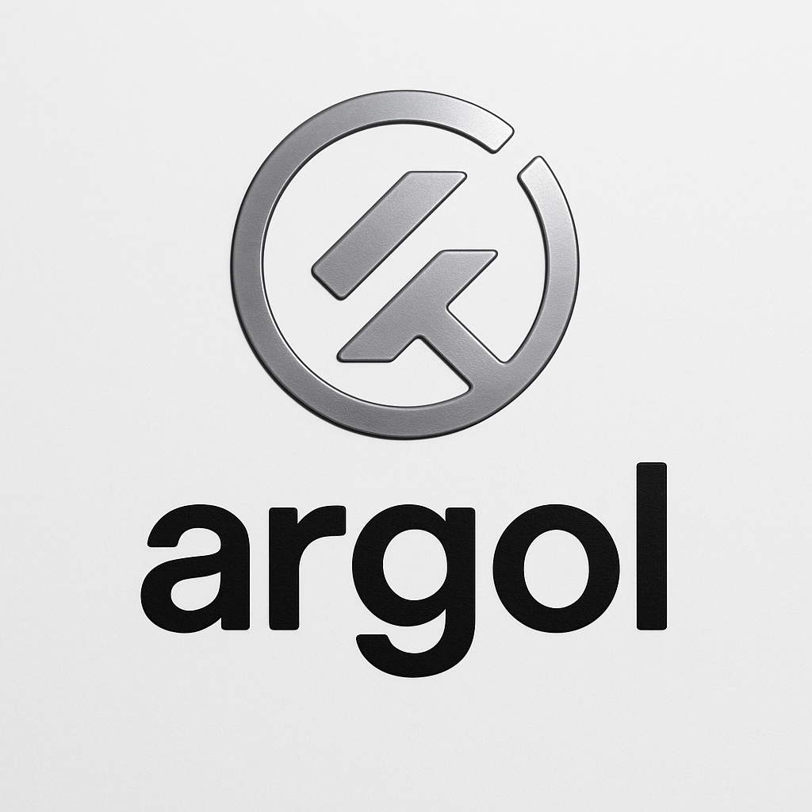

# argol

    

**argol** is a simple but powerful **domain-specific language (DSL)** designed for defining and organizing command-line argument structures. With a `.argol` file, you declare the arguments, options, flags, and subcommands for your application's CLI in a clean and standardized format, ensuring consistent behaviour, validation, and parsing.

The **argol language**  separates your CLI argument logic from the core application code, enabling you to manage and modify your argument structure independently. argol is language-agnostic, providing a standard way to define CLI interfaces.

## License
- MIT license ([LICENSE](./LICENSE) or <https://opensource.org/licenses/MIT>)

> [!WARNING]
> This project is still under active development. The language specification is not 100% complete.
